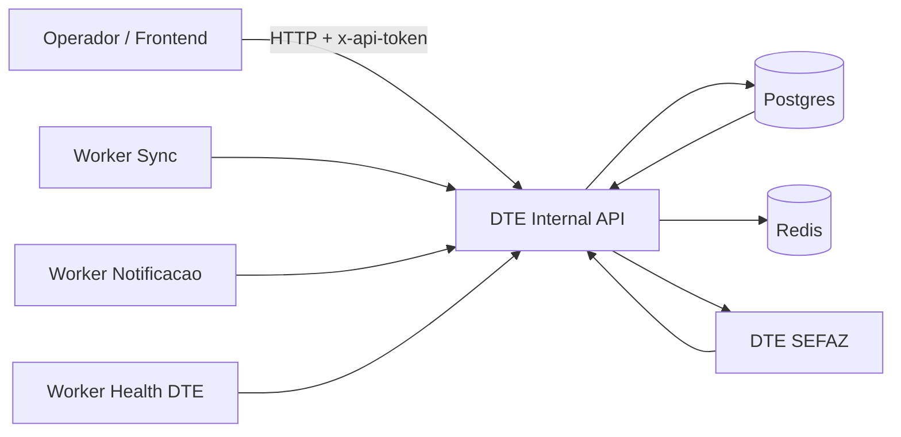
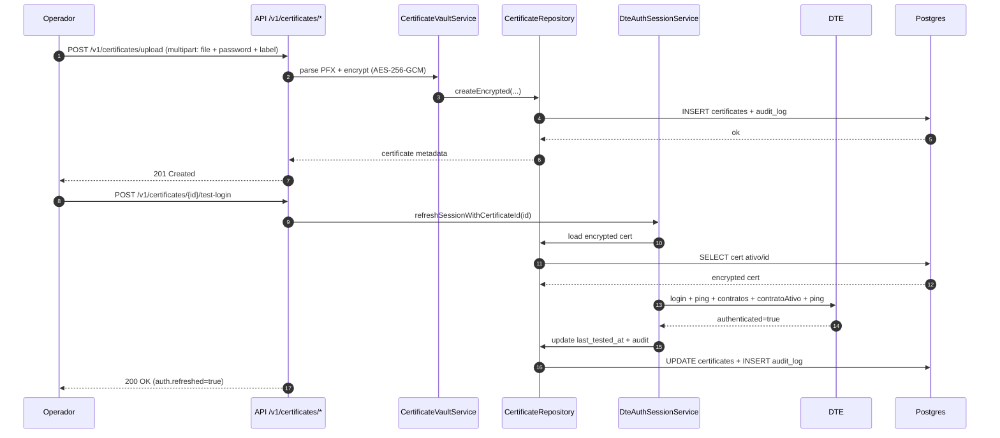
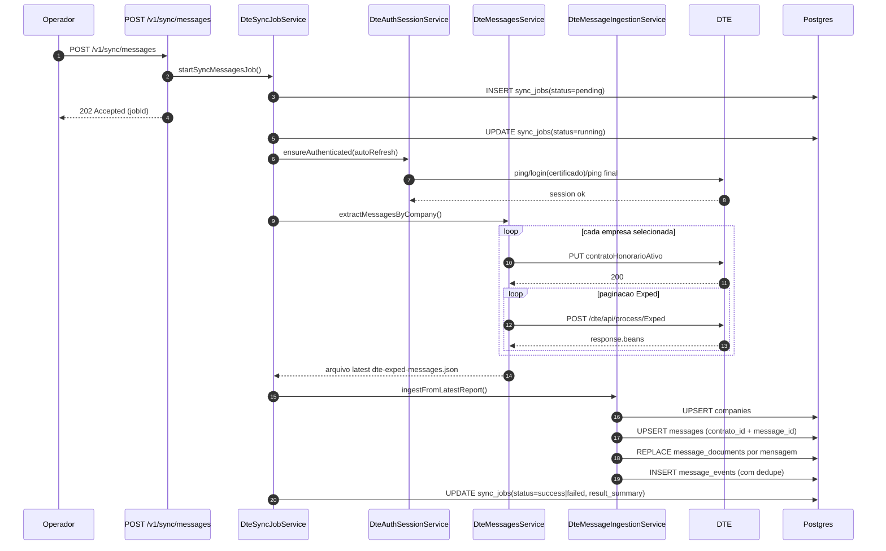
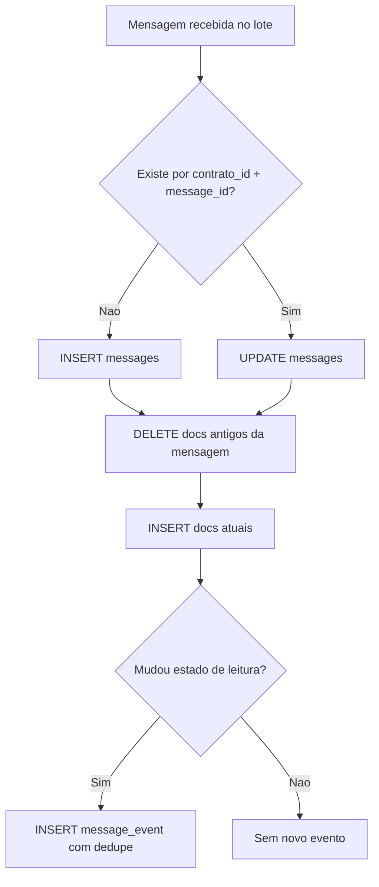
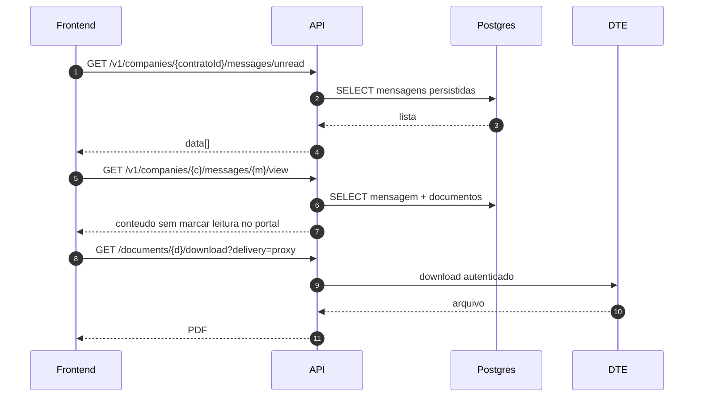
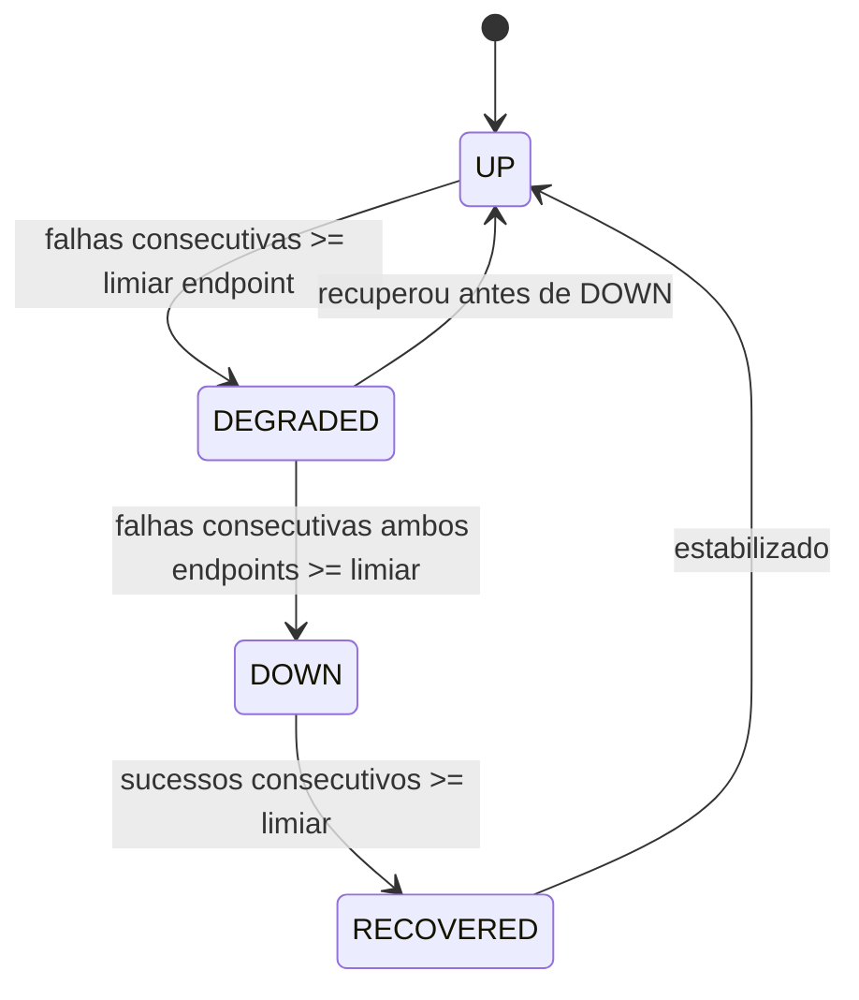
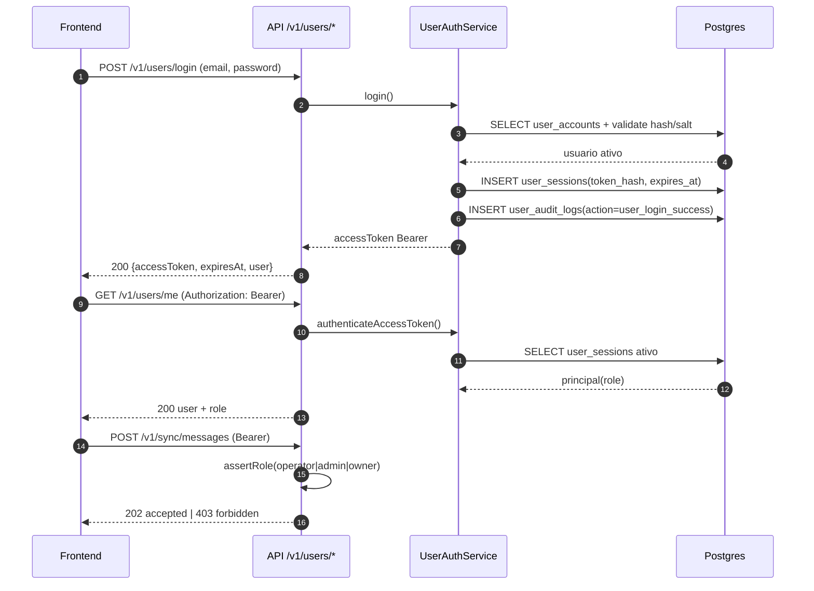

# Fluxo da Aplicacao (Mermaid)

Data base: 12 de marco de 2026.
Escopo: estado atual da API DTE (single-cliente), com vault de certificado, sync, ingestao, eventos e notificacoes.

## 1) Visao geral da arquitetura



## 2) Fluxo de certificado (upload + teste de login)



## 3) Fluxo de sincronizacao de mensagens



## 4) Regra de persistencia no sync (sem duplicar mensagens)



## 5) Fluxo de leitura de mensagem e anexo para frontend



## 6) Fluxo de notificacao de nao lidas

```mermaid
flowchart LR
    A[message_events new_unread/still_unread/read_now] --> B[notification planner]
    B --> C[notification_outbox]
    C --> D[notification worker]
    D --> E[Webhook destino]
    D --> F[notification_deliveries (auditoria)]
    D --> G{falhou?}
    G -- sim --> H[retry/backoff]
    H --> D
    G -- nao --> I[status sent]
```

## 7) Fluxo de health do DTE



## 8) Fluxo de usuarios (login bearer + RBAC)



## 9) Endpoints chave por etapa

1. Certificado:
   - `POST /v1/certificates/upload`
   - `POST /v1/certificates/{certificateId}/test-login`
   - `GET /v1/certificates/current`
2. Sessao/auth:
   - `GET /v1/auth/status`
   - `POST /v1/auth/refresh`
3. Sync e consulta:
   - `GET /v1/jobs?status=pending,running&jobType=sync_messages`
   - `POST /v1/sync/messages`
   - `GET /v1/jobs`
   - `GET /v1/jobs/{jobId}`
   - `GET /v1/companies`
   - `GET /v1/companies/{contratoId}/messages/unread`
4. Documento/anexo:
   - `GET /v1/companies/{contratoId}/messages/{messageId}/documents/{documentoId}`
   - `GET /v1/companies/{contratoId}/messages/{messageId}/documents/{documentoId}/download`
5. Usuarios/RBAC:
   - `POST /v1/users/login`
   - `GET /v1/users/me`
   - `POST /v1/users/logout`
   - `GET /v1/users`
   - `POST /v1/users`
   - `PATCH /v1/users/{userId}/status`
   - `POST /v1/users/{userId}/reset-password`

