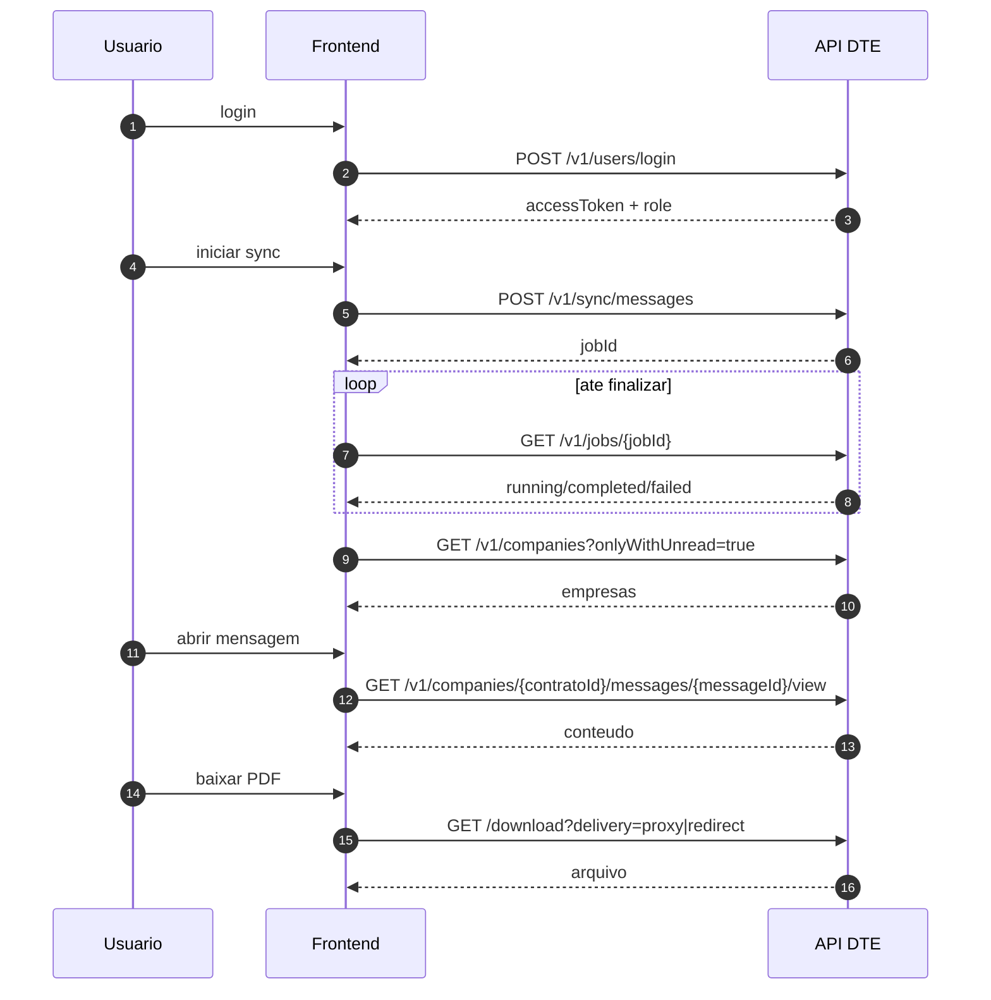

# Proposta de Frontend - DTE Console

Data base: 12 de marco de 2026.
Objetivo: definir um front profissional, orientado a operacao, com baixo acoplamento e foco em mensagens nao lidas.

## 1) Posicionamento do produto

Nome de trabalho: DTE Console.

Proposta:

1. painel unico para operacao diaria de mensagens DTE;
2. leitura operacional sem depender do portal oficial para triagem;
3. orquestracao de sync, jobs e saude em tempo real;
4. base pronta para notificacao e escalonamento.

## 2) Stack sugerida (projeto separado)

1. Next.js 15 + React + TypeScript;
2. TanStack Query para cache/polling;
3. Zustand (ou Context) para sessao e UI state;
4. React Hook Form + Zod para formularios;
5. componente de tabela com server-side pagination;
6. biblioteca de UI consistente (ex.: shadcn/ui) com tema corporativo.

## 3) Arquitetura de front (camadas)

1. `src/app` ou `src/pages`
   - rotas e layout.
2. `src/modules/*`
   - modulos por dominio (`auth`, `companies`, `messages`, `jobs`, `admin`).
3. `src/services/api`
   - cliente HTTP, interceptors, mapeamento de erro.
4. `src/services/contracts`
   - tipos gerados do OpenAPI (codegen).
5. `src/store`
   - sessao, filtros persistidos, preferencias.
6. `src/components`
   - componentes compartilhados.

## 4) Navegacao sugerida

1. `/login`
2. `/dashboard`
3. `/companies`
4. `/companies/:contratoId/messages`
5. `/companies/:contratoId/messages/:messageId`
6. `/jobs`
7. `/alerts` (operator+)
8. `/admin/users` (admin/owner)
9. `/admin/certificates` (admin/owner)

## 5) UX principal por tela

## Login

1. email/senha;
2. feedback de erro de credencial;
3. redirecionamento por sessao ativa.

## Dashboard

1. cards: DTE status, total empresas, total nao lidas, ultimo sync;
2. bloco de incidentes/instabilidade;
3. atalho para disparar sync.

## Empresas

1. tabela com pagina, busca e `onlyWithUnread`;
2. badge de quantidade nao lida;
3. acao "abrir mensagens".

## Mensagens

1. tabela com `readState` (nao_lida/lida/desconhecida);
2. filtros por estado e periodo;
3. destaque visual forte para `nao_lida`.

## Detalhe da mensagem

1. visao limpa via `/view`;
2. metadados de envio/leitura;
3. lista de documentos com acao de download/preview;
4. indicador de origem do arquivo (`storage` ou `DTE`).

## Jobs

1. lista de jobs de sync;
2. status com progresso textual (`pending/running/completed/failed`);
3. exibicao de `errorMessage` com acoes recomendadas.

## Admin usuarios

1. criar usuario;
2. ativar/desativar;
3. reset de senha;
4. trilha de auditoria.

## Admin certificados

1. upload de PFX (arquivo + senha + label);
2. ativar/revogar certificado;
3. teste de login e exibicao da trilha de passos.

## 6) Fluxo operacional mais importante

## 7) Diretrizes de resiliencia no front

1. polling controlado para jobs e health (com pausa quando aba inativa);
2. cache com stale time diferente por recurso:
   - health: 10-30s
   - dashboard: 30-60s
   - empresas/mensagens: 30-120s
3. retry no cliente apenas para falhas transientes;
4. banner global quando DTE estiver `DEGRADED`/`DOWN`;
5. experiencia "degradada": manter leitura de dados ja persistidos no banco.

## 8) Design de autorizacao no front

1. route guard por role;
2. esconder acoes que o usuario nao pode executar;
3. nunca confiar apenas no front (backend ja valida RBAC);
4. fallback padrao para `403` com mensagem e tracking.

## 9) Telemetria recomendada

1. metricas de UX:
   - tempo de login;
   - tempo medio para abrir lista de mensagens;
   - taxa de erro por rota.
2. logs funcionais:
   - sync disparado por usuario;
   - falhas de download de documento;
   - tentativas bloqueadas por permissao.

## 10) Roadmap de front (curto prazo)

1. Sprint 1:
   - auth + layout base + dashboard + empresas.
2. Sprint 2:
   - mensagens, detalhe, download de documento.
3. Sprint 3:
   - jobs, alertas e hardening de erros.
4. Sprint 4:
   - admin usuarios/certificados + refinamento UX + QA final.

## 11) Resultado esperado

1. operacao deixa de depender da navegacao manual no portal DTE para triagem diaria;
2. equipe enxerga rapidamente o que esta `nao_lida`;
3. indisponibilidade do DTE fica visivel no painel;
4. front vira camada de produto, API vira camada de integracao e confiabilidade.
